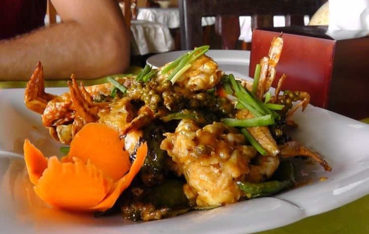

# Restaurantes
 

## Ejercicio integrador

Los compañeros de una conocida escuela gastronómica van probando diferente platos de comida, de manera gratuita porque los elaboran ellos mismos, pero tienen la costumbre de salir de gira todas las semanas por diferentes casas de comidas de la ciudad. Algunos son denominados deglutidores, por su voracidad frente a la mesa, y los restantes se definen como críticos culinarios, por su estilo más refinado. Los deglutidores no se vuelven críticos, ni viceversa.

### Primera parte

No cualquiera puede participar de cada una de las giras que hacen estos estudiantes: sólo pueden ir los que se consideran buena onda y tengan dinero suficiente para lo estimado de la gira. Para ello un deglutidor debe haberse comido más de 20 platos o tener vehículo. Los críticos también pueden ser buena onda, pero dependerá de la cantidad de platos probados y las horas que pasa mirando programas de comida (mínimo 10 horas de programa por cada plato comido). 

Estas giras a veces valen la pena y a veces no. Una gira vale la pena cuando todos los restaurantes y bodegones involucrados valen la pena. 

Vale la pena ir a un bodegón si la carta tiene una variedad suficiente para que cada integrante pida un plato diferente. Se asume que cada persona comerá un plato, más allá que en la mesa lo compartan o vayan probando los platos de los compañeros de una forma aleatoria. La cuenta se paga entre todos, distribuida en partes iguales. 

Ir a un restaurante vale la pena cuando tenga una calificación de 3 o más tenedores y su chef sea profesor de la escuela o trabaje en un programa de televisión. Existen algunos restaurantes étnicos, que aunque no tengan la calificación y el chef requerido, valen la pena en caso que sean de un lugar exótico, como Camboya, Etiopía o Moldavia, entre otras. Todos comen un plato y aunque los críticos suelen elegir los más caros, a la hora de pagar, también la cuenta se paga entre todos por igual. 

La forma en que se determinan los platos a comer en cualquier casa de comidas, es arbitraria. (queda abierta a ser implementada según la creatividad de cada uno)

*Se pide:*

1. Hacer que un integrante de la escuela pruebe (se coma) un plato de comida.
2. Sumar a una persona a una gira. Si no está en condiciones de ir, advertir apropiadamente. Hacer los tests necesarios para probar dicha funcionalidad. 
3. Saber si una gira vale o no la pena.
4. Realizar una gira, lo que implica ir a comer a todos los restaurantes involucrados y actualizar todo lo que sea necesario. (se asume que la gira vale la pena)

### Segunda parte
Como es de suponer, estos compañeros a medida que pasa el tiempo, más allá que sean deglutidores o críticos, van ganando experiencia por lo que se los puede categorizar en principiantes, clásicos y expertos. 

Los principiantes pueden convertirse en clásicos si salieron alguna vez de gira y al hacerlo suman 3 platos comidos más en el caso de ser deglutidores o incrementan en un 10% la cantidad de horas de programas vistos en el caso de los críticos. Los clásicos pueden ascender a expertos, en caso de ser buena onda, pero éstos ya no pueden ascender más. 

*Se pide:*

1. Hacer que todos los estudiantes de la escuela se recategoricen, en caso de poder hacerlo. Probarlo mediante un test que considere importante.

### Para pensar
Aparecen los bares, que son un nuevo posible casa de comidas para incluir en las giras ¿Pueden agregarse sin modificar código existente? Explicar cómo hacerlo y justificar conceptualmente.

